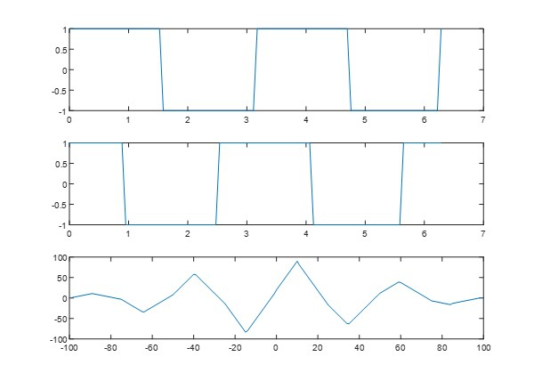
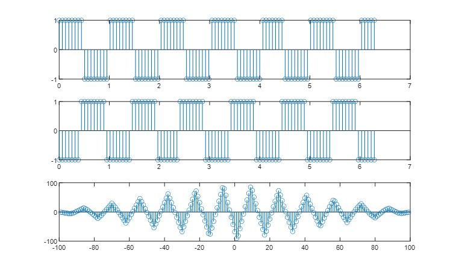
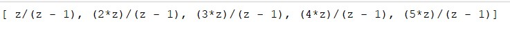
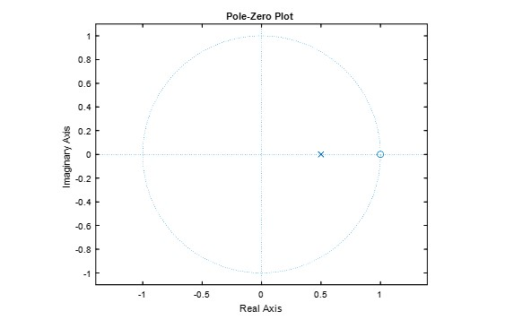

**4.1) Experiment No.:** 04

**4.2) Experiment Date:** 14-May-2023

**4.3) Name of the Experiment:**

Study and Implementation of Continuous and discrete signals Cross Correlation and Z transform in MATLAB.

**4.4) Theory:**

**Cross Correlation of signals:**

The cross-correlation of a continuous signal and a time-shifted version is a mathematical operation that measures the similarity or correlation between the two signals at different time lags. It is often used in signal processing and data analysis to detect patterns or relationships between signals.

Mathematically, the cross-correlation of two continuous signals f(t) and g(t) at a time lag τ is defined as:

C(τ) = ∫[f(t) * g(t - τ)] dt ,where * denotes the convolution operation and τ represents the time shift. The integral is taken over the entire domain of t.

In simple terms, the cross-correlation at a specific time lag τ calculates the integral of the product of the two signals, where one signal is shifted by τ units of time. The result provides a measure of similarity between the two signals at that particular time shift.

**Z- Transform:**

The Z-transform is a mathematical transform used in signal processing and discrete-time systems analysis. It provides a way to convert a discrete-time signal, which is a sequence of numbers defined at equally spaced time intervals, into a complex function of a complex variable. In simple terms, the Z-transform takes a discrete-time signal and represents it in the Z-domain, where the Z variable is a complex number. This transformation allows us to analyze the signal in a different domain and perform various operations such as filtering, system analysis, and solving difference equations.

**4.5) Code:**

**Cross Correlation of a continuous signal and time shifted version of it:**

```matlab

t = linspace(0, 2*pi, 100);

x1 = square(2*t);

x2 = square(2*t-5);

subplot(3,1,1);

plot(t, x1);

subplot(3,1,2);

plot(t, x2);

subplot(3,1,3);

[correlation, time] = xcorr(x1, x2);

plot(time, correlation);
```

**Cross Correlation of a Discrete signal and time shifted version of it:**
```matlab
t = linspace(0, 2*pi, 100);

x1 = square(2*pi*t);

x2 = square(2*pi*t+10);

subplot(3,1,1);

stem(t, x1);

subplot(3,1,2);

stem(t, x2);

subplot(3,1,3);

[correlation, time] = xcorr(x1, x2);

stem(time, correlation);
```

**Z transform:**
```matlab

x = [1, 2, 3, 4, 5];

syms z

Xz = ztrans(x, z);

disp(Xz);
```

**Zeros and Poles:**
```matlab
% Defining the z-transform

num = [1, -1];

den = [1, -0.5];

% Ploting the zeros and poles

zplane(num, den);

title('Pole-Zero Plot');

xlabel('Real Axis');

ylabel('Imaginary Axis');
```

**4.6) Output:**

  
**Cross Correlation of a continuous signal and time shifted version of it:**


**Cross Correlation of a Discrete signal and time shifted version of it:**


**Z transform:**


  
**Zeros and Poles:**



**4.7) Discussion & Conclusion:**

In this experiment, we have implemented Continuous and discrete signals Cross Co-relation and Z transform in MATLAB. Here we have implemented code and take measure the lags by using cross correlation and then we have implemented the z transform. From graph we find the deviation from real signal to time shifted signal. Thus, this experiment was successfully implemented and there was no error found during the execution.