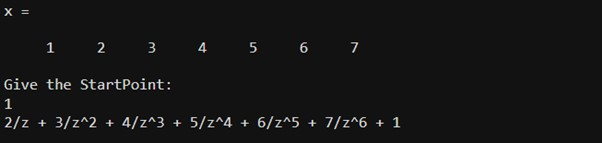
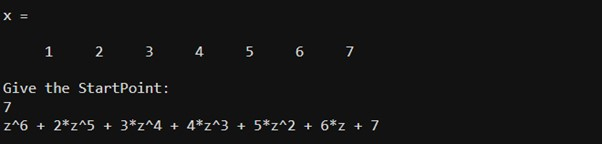
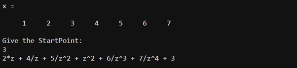

**5.1) Experiment No.:** 05

**5.2) Experiment Date:** 21-May-2023

**5.3) Name of the Experiment:**

Study and Implementation of Causal, Non-Causal and Anti-Causal signal in MATLAB

**5.4) Theory:**

**Causal Signals:**

A causal signal refers to a type of signal that is defined and exists only for current and past time instants. In other words, the value of a causal signal at any given time depends only on its previous values, not on future values. Mathematically, a signal x[n] is considered causal if it satisfies the condition:

<p style="text-align:center;">x[n] = 0, for n < 0,</p>

**Non-Causal Signals:**

A Non-Causal signal refers to a type of signal that depends on future values in addition to its past and current values. Unlike causal signals, which are only defined for current and past time instants, non-causal signals have values that extend into the future as well. 
Mathematically, a signal x[n] is considered non-causal if it satisfies the condition:

<p style="text-align:center;">x[n] ≠ 0, for n > 0</p>

**Anti-Causal Signals:**

An anti-causal signal, in the context of Digital Signal Processing (DSP), refers to a type of signal that depends on future values while being zero for all past and present time instants. Unlike causal signals (which depend on past and present values) and non-causal signals (which depend on both past and future values), anti-causal signals have values that extend only into the future and are zero for all previous times. Mathematically, a signal x[n] is considered anti-causal if it satisfies the condition:
<p style="text-align:center;"> x[n] ≠ 0, for n < 0 </p>
<p style="text-align:center;">x[n] = 0, for n ≥ 0 </p>

**5.5) Code:**

```matlab
clear all;
clc;
x=[1,2,3,4,5,6,7]
y=input('Give the StartPoint:');

X=0;
z=sym('z');
pp=1;
for i=y-1:-1:0
    X=X+x(pp).*z^(i);
    pp=pp+1;
end
p=1;
for i=y:length(x)-1
    X=X+x(i+1).*z^(-p);
    p=p+1;
end
disp(X);
```


**5.6) Output:**

**Causal:**



**Non-Causal:**



**Anti-Causal:**



**5.7) Discussion & Conclusion:**

In this experiment, we have implemented Causal, Non-Causal and Anti-Causal in MATLAB. Here we have implemented code and then we have implemented the z transform of that signal. Here if the startpoint starts from 1 that's mean it is causal or right sided, for non causal the startpoint starts from N(in here that is 7) and for anti causal system there will be both sided signal, thus we can assume any startpoint from 2 to N-1(6 in this case).  Thus, this experiment was successfully implemented and there was no error found during the execution.